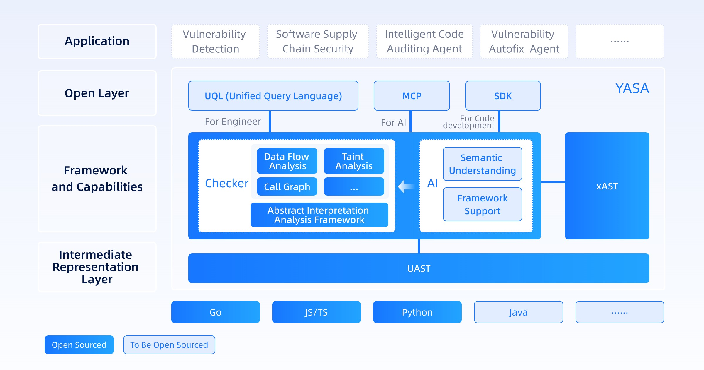

#### [简体中文](README_ZH.md) / [English](README.md)

YASA (Yet Another Static Analyzer) is an open-source static program analysis project. Its core innovation lies in a unified intermediate representation called the Unified Abstract Syntax Tree (UAST), designed to support multiple programming languages. Built on top of UAST, YASA provides a highly accurate static analysis framework. Users can extend its capabilities by writing custom checkers to perform various program analysis tasks—such as AST queries, data flow analysis, and function call graph analysis—and expose functionality through SDK, declarative query language (QL), or MCP.

As a project originally developed within a security team, YASA also comes with built-in taint analysis capabilities, implemented as a checker, to detect security vulnerabilities.

## Components

### YASA-UAST: Unified Abstract Syntax Tree
[YASA-UAST](https://github.com/antgroup/YASA-UAST) is an intermediate representation structure for multi-language program analysis. The UAST-Parser parses code from different programming languages into a unified abstract syntax format. Through UAST, source code in different languages can be converted into a standardized tree structure, enabling unified analysis and processing across multiple languages.

### YASA-Engine: Unified multi-language Analysis Engine
The unified multi-language analysis engine is the core component of a modern program analysis platform. It aims to achieve efficient and precise analysis of multiple programming languages through a unified analysis framework and methodology. Also, with the help of AI capabilities, it addresses issues such as broken chains in traditional program analysis and high adaptation costs for new scenarios. (The AI part is not open-sourced yet.)

### YASA-UQL: Unified Declarative Rule Query Language
Supports declarative unified query rule writing for multiple languages, compatible with CodeQL syntax, lowering the barrier to rule writing while unifying rule sets across languages.

### YASA-MCP: Unified multi-language Program Analysis MCP
Provides atomic analysis APIs for LLM, offering program analysis services that are LLM-friendly.

### YASA-SDK: Unified multi-language Program Analysis SDK
Provides SDK packages supporting multiple programming languages for traditional applications. It provides a variety of granular program analysis APIs, making integration easier and enabling efficient and user-friendly program analysis services within applications.

### xAST
[xAST](https://github.com/alipay/ant-application-security-testing-benchmark) is an open-source evaluation system for SAST/IAST/DAST tool capabilities. In YASA-Engine, it serves as the regression target for post-change testing, and during the process of multi-language adaptation, it provides positive guidance on language syntax support.

## Technical Advantages
### Low Cost for New Language Support
- YASA is directly modeled and analyzed based on UAST. When adapting to a new language, once it is parsed into UAST, the general-layer analyzer's capabilities can be used. After supporting the new language's package structure, the new language's analysis is already supported.

### High Analysis Accuracy, Measurable, and Unified Multi-Languages
- YASA is based on unified multi-language symbolic interpretation capabilities, offering high precision and scalability in static code analysis. It naturally supports field-sensitive, context-sensitive, object-sensitive, path-sensitive, and flow-sensitive capabilities in the field of static analysis.

- During YASA's development, we used [xAST](https://github.com/alipay/ant-application-security-testing-benchmark) to evaluate and verify our capabilities, achieving "measurable capabilities." We compared YASA's performance with other open-source program analysis tools under the xAST evaluation system:

### Open and Friendly
- Introduced the unified declarative rule query language YASA-UQL, compatible with CodeQL syntax, and pioneered a unified QL rule library for multiple languages, making program analysis more engineer-friendly.

- Launched YASA MCP (LLM-friendly) and SDK (App development-friendly).

## Quick Start

[Getting Started](https://www.yuque.com/u22090306/bebf6g/evyf4chw26deq8xq)

[Installation and Deployment](https://www.yuque.com/u22090306/bebf6g/gm7b32tcn9vosgll)

## Join Us
Welcome to submit issues if you encounter any problems!

For code contributions, please refer to [CONTRIBUTION](CONTRIBUTION.md)

## Resource Links
[Official Documentation](https://www.yuque.com/u22090306/bebf6g)

[Learning Resources](https://www.yuque.com/u22090306/bebf6g/sr0y5fqg0kcua5nf)

[Community Activities](https://www.yuque.com/u22090306/bebf6g/fn1rauxwtp7z0l1u)

## Open Source License
Apache License 2.0 - Details in LICENSE Apache-2.0.

## Acknowledgments
Thanks to all developers who have contributed to the YASA project! Special thanks to the open-source community for their support and feedback, enabling us to jointly advance the development of program analysis technology.

YASA - Making code analysis more precise, easier, and smarter.

## Contact Us
[Official Website](https://cybersec.antgroup.com/station)

