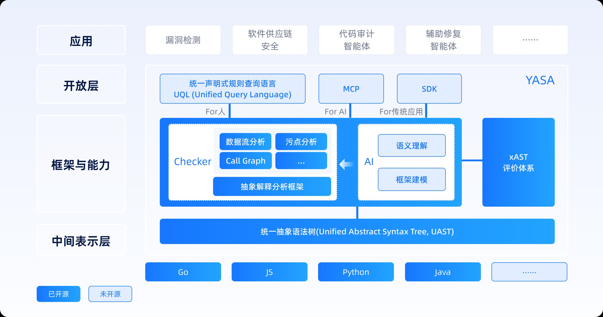
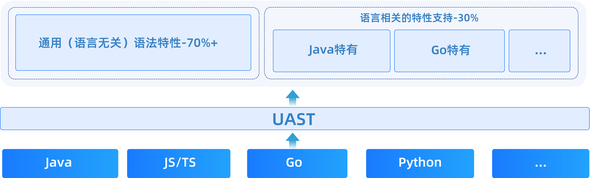
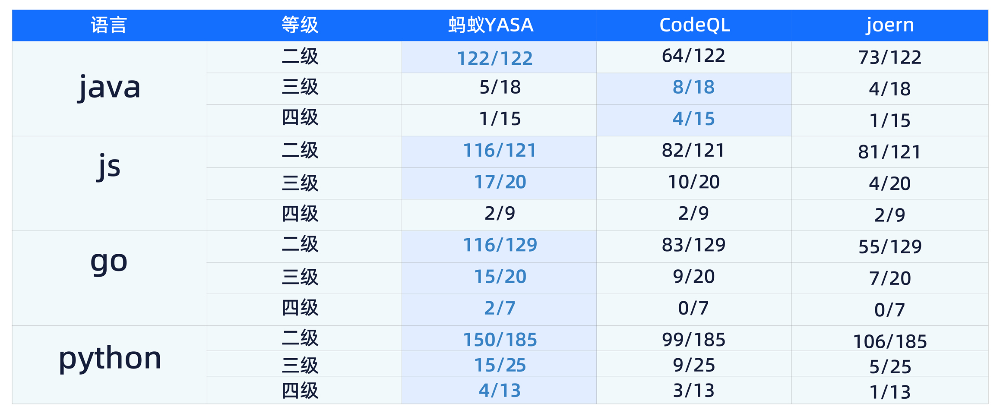

#### [简体中文](README_ZH.md) / [English](README.md)

YASA（Yet Another Static Analyzer, 读作“亚萨” ）是一个开源的静态程序分析项目。其核心是定义了一种多语言通用的中间表达——统一抽象语法树（Unified Abstract Syntax Tree，简称UAST），基于UAST实现了一套高精度的静态程序分析框架。用户可通过编写检查器（Checker）的方式，灵活实现诸如AST查询、数据流分析、函数调用图分析等多种程序分析任务，并通过SDK/自研统一声明式查询语言UQL/MCP等方式对外开放能力。

作为诞生于安全团队的开源项目，YASA也以Checker的形式内置了安全领域最重要的污点分析能力，用于安全漏洞的检测。

## 核心组件介绍

### YASA-UAST 统一多语言抽象语法树
[YASA-UAST](https://github.com/antgroup/YASA-UAST)（Unified Abstract Syntax Tree）是一种面向多语言程序分析的中间表示结构。UAST-Parser将不同编程语言的代码解析为统一的抽象语法格式，通过UAST，不同语言的源代码可以被转换为标准化的树形结构，从而实现多语言的统一分析和处理。

### YASA-Engine 统一多语言分析引擎
统一多语言分析引擎是现代化程序分析平台的核心组件，旨在通过一套统一分析框架和方法论，实现对多种编程语言的高效、精准分析。 同时借助AI能力，弥补了传统程序分析易断链、新场景适配成本高的问题。（AI部分暂未开源，敬请期待）

### YASA-UQL 统一声明式规则查询语言
支持声明式的多语言统一查询式规则编写，兼容codeql语法，降低编写规则门槛同时统一多语言的规则集。

### YASA-MCP 统一多语言程序分析MCP
为大模型提供原子化的分析API，提供大模型友好的程序分析服务。

### YASA-SDK 统一多语言程序分析SDK
为传统应用提供多语言支持的 SDK 包，内置多种原子化程序分析 API，便于集成和调用，为应用程序提供高效、易用的程序分析服务。

### xAST
[xAST](https://github.com/alipay/ant-application-security-testing-benchmark)是一个开源的SAST/IAST/DAST工具能力评测体系。在YASA-Engine中作为变更后测试所用的回归靶场，并且在YASA研发的过程中，提供对语言语法支持的正向指引。

## 技术优势

### 新语言支持成本低
- YASA直接基于UAST进行建模分析，当适配新语言时，将其解析到UAST后，即可使用通用层分析器的分析能力，支持新语言的包结构后，即已支持新语言的分析。

### 分析精度高、可衡量、多语言统一
- YASA基于统一多语言符号解释能力，在静态代码分析分析上具有高精度、可扩展的技术优势。针对静态分析领域中的域敏感、上下文敏感、对象敏感、路径敏感、流敏感天然具备较好的支持能力。

- 在YASA研发的过程中，使用[xAST](https://github.com/alipay/ant-application-security-testing-benchmark)对YASA-Engine的能力进行评测与验证，达到'能力可衡量'的效果。我们对比了YASA以及其他开源程序分析工具在xAST评价体系上的表现:

### 开放、友好
- 推出统一声明式规则查询语言UQL，兼容codeql语法，并业界首创多语言统一的QL规则库，使程序分析更易用。

- 推出YASA MCP（大模型友好）与SDK（应用使用友好）

## 快速开始
[快速上手](https://www.yuque.com/u22090306/bebf6g/evyf4chw26deq8xq)

[安装部署](https://www.yuque.com/u22090306/bebf6g/gm7b32tcn9vosgll)

## 加入我们
遇到问题欢迎提交issue！

参与代码贡献，详见[CONTRIBUTION](https://www.yuque.com/u22090306/bebf6g/rgm1xmoa38wlfxzc)

## 资源链接
[官方文档](https://www.yuque.com/u22090306/bebf6g)

[教学资料](https://www.yuque.com/u22090306/bebf6g/sr0y5fqg0kcua5nf)

[社区活动](https://www.yuque.com/u22090306/bebf6g/fn1rauxwtp7z0l1u)

## 开源协议
Apache License 2.0 - 详情 LICENSE Apache-2.0

## 致谢
感谢所有为YASA项目做出贡献的开发者！特别感谢开源社区的支持和反馈，让我们能够共同推动程序分析技术的发展。

YASA - 让代码分析更精确、更易用、更智能

## 联系我们

[社区官网](https://cybersec.antgroup.com/)

