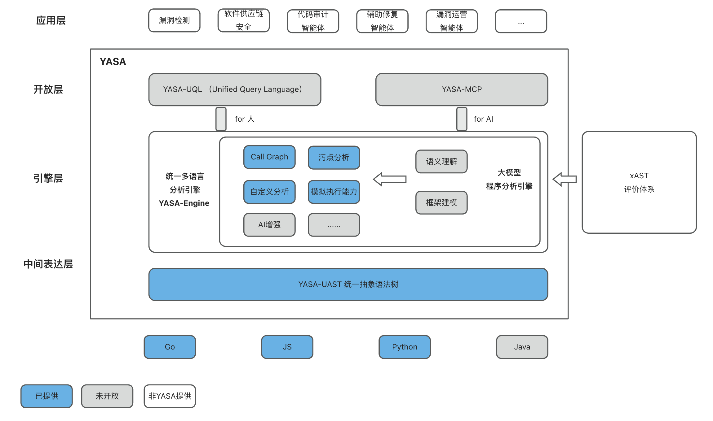
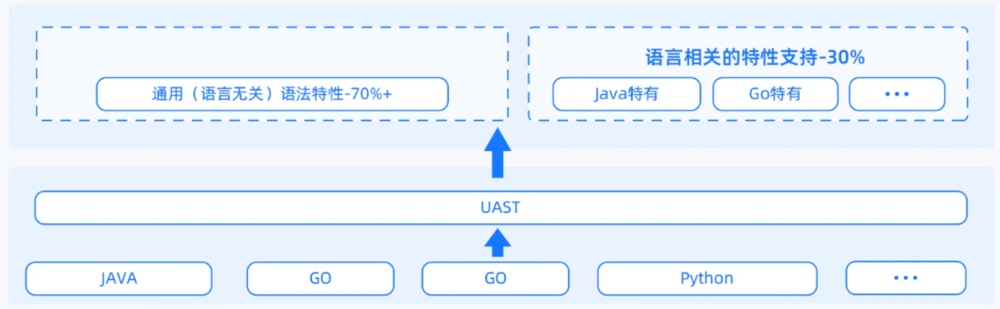
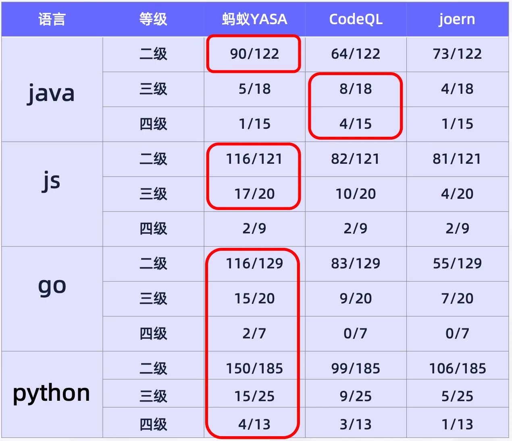

## [ Official Website ](https://cybersec.antgroup.com/)
#### [简体中文](README_ZH.md) / [English](README.md)

## YASA是什么

你好！这里是开放式统一多语言程序分析产品YASA（Yet Another Static Analyzer ）！

YASA是一款面向工业级应用的程序分析产品。YASA通过构建多语言统一抽象语法树（UAST）中间表示，结合模拟执行技术与大模型推理，实现了精确的数据流、指针和污点分析。

我们致力于构建开放、统一、高效、准确的程序分析产品，为企业级代码安全和质量保障提供有力的技术支撑。

## YASA可以做什么

YASA提供多语言统一程序分析能力，包含YASA-UAST、YASA-Engine、YASA-UQL、YASA-MCP、YASA-SDK、xAST六个核心部分。

目前[YASA-UAST](https://github.com/antgroup/YASA-UAST)、YASA-Engine和[xAST](https://github.com/alipay/ant-application-security-testing-benchmark)已经开源，YASA-UQL、YASA-MCP、YASA-SDK后续进行开源。

YASA-Engine当前默认提供了多语言统一AST解析、污点数据流分析、CG生成等能力。另外，YASA提供自定义checker能力，用户可根据具体业务需求进行灵活扩展和定制化检查器开发，欢迎广大开发者和企业用户体验使用。目前已开源JS/TS、Python、Go语言的支持，Java语言暂未开源，敬请期待。

## 核心组件介绍

### YASA-UAST
[YASA-UAST](https://github.com/antgroup/YASA-UAST)（Unified Abstract Syntax Tree）是一种面向多语言程序分析的中间表示结构。UAST-Parser将不同编程语言的代码解析为统一的抽象语法格式，通过UAST，不同语言的源代码可以被转换为标准化的树形结构，从而实现多语言的统一分析和处理。

### YASA-Engine 统一多语言分析引擎
统一多语言分析引擎是现代化程序分析平台的核心组件，旨在通过一套统一分析框架和方法论，实现对多种编程语言的高效、精准分析。 同时借助AI能力，弥补了传统程序分析易断链、新场景适配成本高的问题。（AI部分暂未开源，敬请期待）

### YASA-UQL 统一声明式规则查询语言
支持声明式的多语言统一查询式规则编写，兼容codeql语法，降低编写规则门槛同时统一多语言的规则集。

### YASA-MCP 统一多语言程序分析MCP
为大模型提供原子化的分析API，提供大模型友好的程序分析服务。

### YASA-SDK 统一多语言程序分析SDK
为传统应用提供多种语言的SDK包，使YASA更易被集成，提供应用中易用的程序分析服务。

### xAST
[xAST](https://github.com/alipay/ant-application-security-testing-benchmark)是一个开源的SAST/IAST/DAST工具能力评测体系。在YASA-Engine中作为变更后测试所用的回归靶场，并且在YASA研发的过程中，提供对语言语法支持的正向指引。

## YASA技术优势

### 新语言支持成本低
- YASA直接基于UAST进行建模分析，当适配新语言时，将其解析到UAST后，即可使用通用层分析器的分析能力，支持新语言的包结构后，即已支持新语言的分析。

### 分析精度高、可衡量、多语言统一
- YASA基于统一多语言符号解释能力，在静态代码分析分析上具有高精度、可扩展的技术优势。针对静态分析领域中的域敏感、上下文敏感、对象敏感、路径敏感、流敏感天然具备较好的支持能力。

- 在YASA研发的过程中，使用[xAST](https://github.com/alipay/ant-application-security-testing-benchmark)对YASA-Engine的能力进行评测与验证，达到'能力可衡量'的效果。我们对比了YASA以及其他开源程序分析工具在xAST评价体系上的表现:

### 让程序分析更开放、易用、友好
- 推出统一声明式规则查询语言UQL，兼容codeql语法，并业界首创多语言统一的QL规则库，使程序分析更易用。

- 推出YASA MCP（大模型友好）与SDK（应用使用友好）

## 快速开始
[快速上手](https://www.yuque.com/u22090306/bebf6g/evyf4chw26deq8xq)

[安装部署](https://www.yuque.com/u22090306/bebf6g/gm7b32tcn9vosgll)

## 加入我们
遇到问题欢迎提交issue！

参与代码贡献，详见[CONTRIBUTION](https://www.yuque.com/u22090306/bebf6g/rgm1xmoa38wlfxzc)

## 资源链接
[官方文档](https://www.yuque.com/u22090306/bebf6g)
[社区活动](https://www.yuque.com/u22090306/bebf6g/fn1rauxwtp7z0l1u)

## 开源协议
Apache License 2.0 - 详情 LICENSE Apache-2.0

## 致谢
感谢所有为YASA项目做出贡献的开发者！特别感谢开源社区的支持和反馈，让我们能够共同推动程序分析技术的发展。

YASA - 让代码分析更精确、更易用、更智能

## 联系我们

[社区官网](https://cybersec.antgroup.com/)

